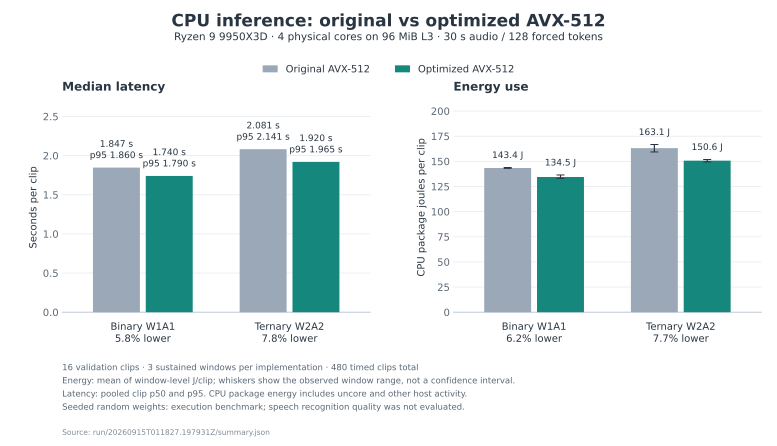

# wilderness-labs-stt

Low-bit, low-power speech-to-text, taken from packed binary/ternary kernels
through failed from-scratch training to a working ternary Whisper.

**Headline (September 2026):** Whisper tiny.en with every attention and
feed-forward projection *and* the token embedding constrained to three values
{-1, 0, +1}, recovered by quantization-aware fine-tuning, transcribes
LibriSpeech test-clean at **12.1% WER from a 12.2 MB file**. The identically
fine-tuned FP32 model scores 4.5% at 151 MB. Every number below is scored on
the exported artifact, not the training graph.

| Whisper tiny.en arm | test-clean WER | test-other WER | Artifact |
| --- | ---: | ---: | ---: |
| FP32 zero-shot (reproduces the published figure) | 5.66% | 14.54% | 151.0 MB |
| FP32 fine-tuned control, same data and steps | 4.50% | 12.37% | 151.0 MB |
| Ternary projections, post-training quantization only | 100% | 100% | 46.8 MB |
| Ternary projections, QAT with cross-entropy alone (v1) | 50.46% | 71.86% | 46.8 MB |
| Ternary projections, QAT with ramp + distillation (v2) | 13.12% | 30.90% | 46.8 MB |
| Ternary projections + tied embedding, v2 | **12.12%** | **28.42%** | **12.2 MB** |

Full tables, learning-rate selection and the secondary error analysis:
[`finetune/whisper-ternary/results/`](finetune/whisper-ternary/results/).
Design and protocol: [`finetune/whisper-ternary/DESIGN.md`](finetune/whisper-ternary/DESIGN.md).

## Why this exists

The original goal was a hands-free, fully offline voice manual of Tactical
Combat Casualty Care procedures for USAF Pararescue, which needs speech
recognition that runs for days on a battery behind enemy lines. That framed
the engineering question this repository actually answers: how far can
speech-to-text be pushed toward 1 to 2 bits per weight on modern hardware, and
what does it cost in accuracy and energy? Nothing here is a fielded system.

## What is in the repository

| Directory | What it is | State |
| --- | --- | --- |
| [`finetune/whisper-ternary/`](finetune/whisper-ternary/) | Ternary-weight QAT of Whisper tiny.en: preregistered design, training, export, evaluation, resumable sweep, power flight recorder, 123 tests | Complete, results above |
| [`custom/cpu-inference/`](custom/cpu-inference/) | Hand-written AVX-512 VPOPCNTDQ binary/ternary kernels for a Whisper medium.en-shaped graph on a Ryzen 9 9950X3D, with RAPL energy measurement and bit-exact verification | Complete, benchmarks below |
| [`custom/inference-efficiency/`](custom/inference-efficiency/) | Packed CUDA GEMV and fused decoder kernels on an RTX 5090, NVML energy measurement, CTranslate2 controls, independent audit | Complete, benchmarks below |
| [`custom/binary_stt/`](custom/binary_stt/) | 488M-parameter binary/ternary CTC Conformer trained from scratch on streamed LibriSpeech, AMI, People's Speech; learning-rate and quantizer studies | Negative result, documented |
| [`custom/stt-distillation/`](custom/stt-distillation/) | 604M ternary student distilled from pretrained teachers, with onset, recovery and augmentation pilots | Negative result, documented |
| [`custom/stt/`](custom/stt/), [`custom/autoresearch/`](custom/autoresearch/) | Small ternary CTC pilot, real-audio VAD gating, and a sandboxed one-hour GPU autoresearch loop with an independent evaluator | Pipelines work; models did not reach usable accuracy |
| [`finetune/stt/`](finetune/stt/) | Hash-locked local Whisper tiny.en reference used as the working recognizer and QAT base | Complete |
| [`custom/PLAN.md`](custom/PLAN.md), [`DATA_PLAN.md`](DATA_PLAN.md) | The original architecture, precision contract and data plan | Historical |

## Results in more detail

### 1. Ternary Whisper (the accuracy leg)

Recipe that worked (v2): keep FP32 latent weights, quantize each projection
row to {-1, 0, +1} with a per-row absmean scale every forward pass, identity
straight-through gradient, ramp from float to ternary over the first 25% of
steps, loss = 0.5 cross-entropy + 0.5 KL to the frozen FP32 model, 12,000
steps of batch 32 on 464 hours of LibriSpeech, learning rate 1e-3, about 19
minutes per run on the 5090. Recipe that failed (v1): the same quantizer
applied at step 0 with cross-entropy alone; two of three learning rates
collapsed into audio-independent language-model loops.

What the secondary analysis adds: the remaining ternary errors on the test sets
are word substitutions. A small number of utterances where the decoder keeps
generating text after the speech ends account for under half a point, and a
duration-based hypothesis cap that truncates no reference transcript closes
most of that.

Limits: tiny.en only, LibriSpeech only, greedy decoding, activations left in
floating point. The trained ternary model has not yet been run through the
packed kernels below, which need packed activations too.

### 2. CPU kernels (the efficiency leg)

Whisper medium.en-shaped graph, 762M parameters, seeded random weights, 30 s
clips with 128 forced decoder tokens, four physical cores, sustained windows
with CPU package energy from RAPL. Random weights mean these measure execution,
not recognition.

| Backend | Median s / clip | CPU J / clip | Learned-weight storage |
| --- | ---: | ---: | ---: |
| Dense FP32 reference of the same quantized model | 10.8 | — | 3,049 MB |
| CTranslate2 INT8 (pretrained control, other engine) | 3.36 | 256 | — |
| W1A1 scalar POPCNT | 2.40 | 188 | 100 MB |
| W1A1 AVX-512, optimized | **1.74** | **134** | **100 MB** |
| W2A2 AVX-512, optimized | 1.92 | 151 | 200 MB |

All packed outputs match the dense reference bit for bit across every core
placement tested. Details and audits: [`custom/cpu-inference/RESULTS.md`](custom/cpu-inference/RESULTS.md),
[`custom/cpu-inference/OPTIMIZATION_RESULTS.md`](custom/cpu-inference/OPTIMIZATION_RESULTS.md).

The last kernel iteration, measured against the original AVX-512 backend over
480 timed clips in fresh-process windows (whiskers are observed window ranges):



### 3. GPU kernels

Same graph on the RTX 5090 with CUDA-graph replay. An agent-led kernel sprint
with an independent measurement audit reduced GPU energy per clip against the
original packed runtime by **15.8% for ternary** and **13.6% for binary**
(vectorized packed GEMV plus QKV and epilogue fusion), with lower p95 latency
and 100% prediction agreement for ternary. Six-way comparison, energy meter and
audit: [`custom/inference-efficiency/`](custom/inference-efficiency/).

### 4. What did not work, and what it taught

Four attempts to train low-bit speech models without a floating-point starting
point all failed to generalize: a 488M binary/ternary Conformer, a 604M ternary
distillation student, a 9M conventional Conformer sanity check (memorized 16
clips at 4.6% WER, 100% WER on held-out speech after its short budget) and a
1.5M ternary CTC pilot. The write-ups isolate the causes: memorization gates
that did not predict broad generalization, floating-point acoustic collapse
under long training, ternary students that fit the training speakers and
transferred poorly, and quantizing models that had not yet learned to
transcribe. A review of Microsoft's VibeVoice-ASR-BitNet release
([`custom/binary_stt/VIBEVOICE_ASR_BITNET_REVIEW.md`](custom/binary_stt/VIBEVOICE_ASR_BITNET_REVIEW.md))
crystallized the fix: quantize a pretrained model, never a random one. The
ternary Whisper result followed directly from that.

The real-audio VAD gating experiment is a smaller negative result of the same
kind: gates that scored well on whole clips dropped most speech when applied to
streaming one-second windows (92% WER against 11.8% always-on).

## How the work was done

- Every experiment has a written design fixed before running, with arms,
  quantized sets, data splits, selection rules and reported outputs. Selection
  uses dev-clean only; test splits are scored once per arm.
- Independent code review before every run: the Whisper experiment's code
  went through repeated reviews by a second model at maximum reasoning effort,
  with findings fixed or explicitly accepted and documented in the design.
- Reproducibility: hash-locked runtimes and checkpoints, exports that
  reconstruct bit-exactly, resumable sweeps that validate every reused
  artifact, and a per-second power log alongside each sweep after the training
  machine tripped its circuit breaker twice.
- Model weights never enter Git. Code, designs, result tables, manifests and
  hashes do.

## Reproducing

Each directory's README gives its exact commands. The code assumes this
machine: NixOS, an RTX 5090, a pinned Nix Python runtime, and a data disk at
`/mnt/hd` that every wrapper refuses to run without. Datasets are public
(LibriSpeech, AMI, People's Speech, YODAS-Granary, OpenSLR noise) and are
downloaded by the preparation scripts with their licenses recorded. The
Whisper experiment end to end:

```sh
finetune/whisper-ternary/python -m unittest discover -s finetune/whisper-ternary/tests
finetune/whisper-ternary/python finetune/whisper-ternary/sweep.py --protocol v2
```

To transcribe your own 16 kHz audio with the 12.2 MB ternary model, optionally
side by side with the FP32 original:

```sh
finetune/whisper-ternary/python finetune/whisper-ternary/transcribe.py clip.wav --compare-fp32
```

```
[ternary] owing to his insistence on low pressure direct current for use in densely populated districts ...
[fp32] owing to his insistence on low pressure, direct current for use in densely populated districts ...
```

## License

MIT. See [LICENSE](LICENSE). Pretrained Whisper weights are Apache-2.0 from
OpenAI; dataset licenses are recorded in each directory's provenance files.
